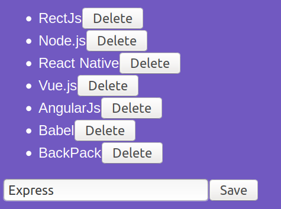

# Tech's list

<p align="center">
  
</p>

[Rocketseat's GoStack bootcamp](https://rocketseat.com.br/bootcamp) introductory module to ReactJS.

# About

A ReactJS app that uses `localStorage` to manage a list of your favorite techs. It allows inserting and deleting techs.

It has `Backpack` and `Babel` configured.

# Set up

1. Clone the repository
```sh
git clone git@github.com:Artenes/rocketseat-bootcamp-module04.git
cd rocketseat-bootcamp-module04
```

2. Install dependencies
```sh
yarn
```

3. Run the app
```sh
yarn dev
```

4. Access [http://localhost:8080](http://localhost:8080).

# Contact

Artenes Nogueira - [artenes.nogueira@gmail.com](mailto:artenes.nogueira@gmail.com)

Linkedin - [linkedin.com/in/artenes/](https://www.linkedin.com/in/artenes/)

Blog - [artenesbok.com/](http://artenesbok.com/)